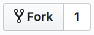
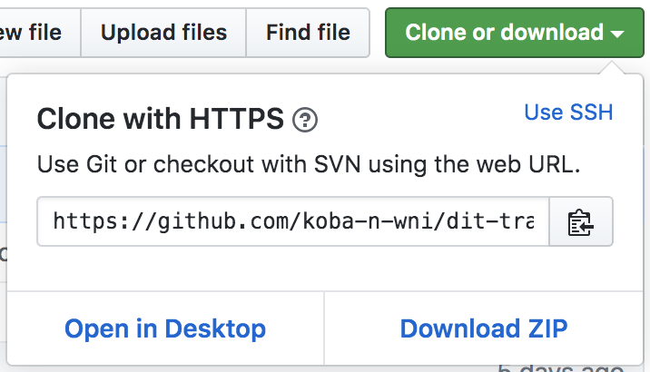
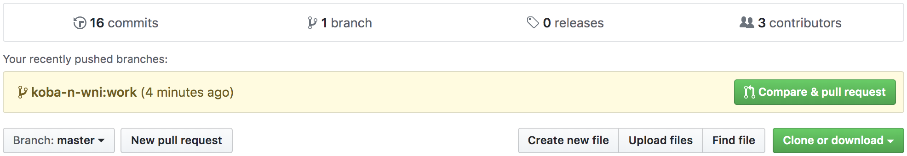
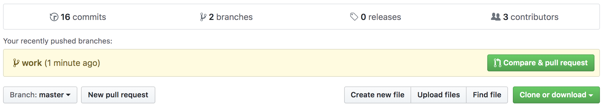

# バージョン管理とGit、GitHub、プルリクエスト [演習]

以下、次のように表す。

* プロジェクトページURL：https://github.com/weathernews/dit-training-FY34
* プロジェクト名：dit-training-FY34
* アカウント名：小林の場合なら`koba-n`のこと
* GitHubアカウント名：小林の場合なら`koba-n-wni`のこと

## 準備：GitHubアカウント準備

GitHubのWeathernews organizationにアカウントがない人は作りましょう。

* メールアドレス：`<会社のアドレス>`
* ユーザ名：`<アカウント名>-wni`

1. 上記メールアドレスおよびユーザ名でsign upする
2. 小林にsign upした旨伝える
3. 小林がinviteするのを待つ
4. <プロジェクトページURL>にブラウザでアクセスできるのを確認

## 準備：コミットに入る自分の情報の設定

Gitでは、コミットした人の情報として、コミットにユーザ名とメールアドレスが入ります。
デフォルトだと使っている環境でのユーザ名やホスト名が使われてしまうので、
設定していない人は設定しておきましょう。

1. `git config --global user.name <フルネーム（アルファベット表記）>`
2. `git config --global user.email <会社のメールアドレス>`
3. `cat ~/.gitconfig`

コマンドで設定した内容が`~/.gitconfig`に書き込まれていることがわかる。

## ハンズオン＆演習1：リポジトリのクローンを手元に作成する

1. <プロジェクトページURL>の「Fork」ボタンを押す
2. 自分のプロフィールページの「Repositories」に <プロジェクト名> という名前のページができてリンクが張られていることを確認
3. そのプロジェクトへのリンクに飛ぶ
4. 緑色の「Clone or download」ボタンを押す
5. 出てきたメニューに表示されたURLの右のボタンを押す（とURLがコピーされる）。
6. ターミナルで、適当なディレクトリを作成し、そこに移動。
7. `git clone https://<GitHubアカウント名>@github.com/<GitHubアカウント名>/<プロジェクト名>.git` と実行する （上でコピーしたURLの中に「`<GitHubアカウント名>@`」を挟むのがポイント）。
8. `ls`で、`<プロジェクト名>`というディレクトリができているのを確認（上の`git clone`コマンドで出てきたメッセージの最後が`done.`で終わっていたらおそらくできているはず）。
9. `cd <プロジェクト名>`でディレクトリの中に入っておく。
10. `ls -al`してみる。

「Fork」ボタン：

「Clone or download」ボタンを押して出てくるメニュー：

`ls -al`で、いくつかファイルがあること、また`.git`というディレクトリがあることがわかるはずです。
`.git`の中身がリポジトリです。それ以外は、リポジトリからチェックアウトされた最新版のファイルです。
`git clone`コマンドでは、リポジトリのクローンを手元に作成するだけでなく、そこから最新のファイルをチェックアウトするところまでやってくれることがわかります。

## ハンズオン＆演習2：ブランチの切り替え、編集〜コミットの流れをやってみる

### 注意点

* コミットした内容はあとの課題で共有してもらいます
* なので、コミット内容には、不適切な内容、パスワードなどの秘密情報は含めないでください
* GitHubに容量制限があり、実務でもないので、無駄に大きなファイルは入れないでください

### アドバイス

以降で、`git branch`、`git status`、`git diff`、`git diff --cached`、`git log`は、状態を表示するだけで特に何かを変更するわけではないので、何回でも実行して問題ありません。むしろ、動作に慣れないうちはしょっちゅう実行して確認したほうがよいでしょう。

また、以降の手順で自分のアカウント名のディレクトリを作っているのは、あとの課題で共有してもらうときに、他の人のファイル名と被らないようにするためです。Gitでの操作上、そういうことが必要なわけではありませんので、あくまで課題のためと理解してください。

また、`t01`というディレクトリはトレーニング第1回用のディレクトリという意味で使っています。今後も、同じようにしてディレクトリを増やしていくつもりです。

### ブランチを作って切り替えてみる

1. `git branch`で、存在するブランチと今いるブランチを確認
2. `git checkout -b work`で、workというブランチを作ってそちらに移動（表面上は何も変わらない）
3. `git branch`で、あらためてブランチを確認（先程の結果と違うはず）

なお、別にworkである必要はありません。複数のブランチを行き来することもあるので、実務ではもっと意味のある名前をつけましょう。

### 編集してコミットしてみる

1. `cd t01`
2. `mkdir <アカウント名>`（自分のディレクトリを作ってみる）
3. `cp sample0.md <アカウント名>/README.md` （適当な`README.md`を自分のディレクトリの下に作ってみる）
4. `git log` （確認。あとで比較する）
5. `git status` （確認。あとで比較する）
6. `git diff` （確認。既存のファイルには変更はないので空のはず。あとで比較する）
7. `git diff --cached` （確認。同じく空のはず。あとで比較する）
8. `git add <アカウント名>/README.md` （ファイルの追加をステージングに反映させる）
9. `git status` （確認。変化があるはず）
10. `git diff` （確認。こちらは空のままのはず）
11. `git diff --cached` （確認。ステージングなので先程から変化があるはず）
12. `git commit -m 'Add my own README.md'`
13. `git log` （今のコミットが最新コミットとしてログに追加されているだろうか？）
14. `git status` （確認）
15. `git diff` （確認）
16. `git diff --cached` （確認）

### もっと複雑に編集してコミットしてみる。

1. `cp sample1.md <アカウント名>/README.md` （先程のファイルを上書きする。ここでは簡単のためコピーしているが、`<アカウント名>/README.md`を2箇所編集するのをシミュレートしたつもり）
2. `git status` （確認）
3. `git diff` （確認。差分がファイル内に2箇所あることがわかるはず）
4. `git diff --cached` （確認。こちらは空のはず）
5. `git add -p`
6. `Stage this hunk [y,n,q,a,d,j,J,g,/,e,?]?`という質問を2回尋ねられるので、1回目は`y`、2つ目は`n`と答える（2箇所の差分のうち1箇所目だけをステージングに反映させる）
7. `git status` （確認）
8. `git diff` （確認。2つ目の差分だけのはず）
9. `git diff --cached` （確認。1つ目の差分だけのはず）
10. `git commit -m 'Change the title of my project'`
11. `git log -p` （今のコミットの内容は期待通りか？）
12. `git diff` （確認。2つ目の差分だけのはず）
13. `git diff --cached` （確認。空のはず）
14. `git add <アカウント名>/README.md`
15. `git status` （確認）
16. `git diff` （確認。空のはず）
17. `git diff --cached` （確認。2つ目の差分だけのはず）
18. `git commit -m 'Add one more section to README.md'`
19. `git log -p`

### ログの表示を色々変えてみる

1. `git log`
2. `git log --oneline`
3. `git log -p`
4. `git log --stat`
5. `git log --graph`

最後の`git log --graph`は、あとで色々マージしたあとに使うと役に立つはず。

## ハンズオン＆演習3：マージしてみる

### まずはfixブランチでコミット

1. `git checkout -b fix`
2. `git branch` （fixにいるはず）
3. `cp sample2.md <アカウント名>/README.md` （これも、ファイルを編集したのをシミュレートしている）
4. `git diff`
5. `git add <アカウント名>/README.md`
6. `git commit -m 'Fix a typo'`
7. `git log`

### 続いてworkブランチでコミット

1. `git checkout work` （`-b`オプションは「ブランチを作る」という意味。今回は既存のブランチに移動するだけなので、`-b`はつけない）
2. `git branch` （workにいるはず）
3. `cat <アカウント名>/README.md` （先程fixブランチで行った変更は、こちらには入っていないのがわかる）
4. `cp sample3.md <アカウント名>/README.md` （これも、ファイルを編集したのをシミュレートしている）
5. `git diff`
6. `git add <アカウント名>/README.md`
7. `git commit -m 'Welcome more'`
8. `git log`

### workブランチにfixブランチをマージ

1. `git merge fix` （現在のworkブランチにfixブランチをマージする）
2. `cat <アカウント名>/README.md` （確認。fixブランチで行った変更が入っているはず）
2. `git log`
3. `git log --graph`
4. `git branch` （確認。あとで比較する）
5. `git branch -d fix` （fixブランチの役割は終わったので削除）
6. `git branch` （確認。fixブランチが消えているはず）

ちなみに、手元にマージしていないブランチを削除しようとすると、エラーになるはず。
ブランチは最終的にマージされるはず、という想定で、そのような安全な作りとなっている。

## ハンズオン＆演習4：自分なりの変更を色々加えてみる

ディレクトリ`t01/<アカウント名>`は今回の課題にしか使わないので、
自由にファイルを追加したり編集を加えて、コミットしてみてください。
最終的にworkブランチにマージしてもらえれば、ブランチも適当に作ってみるとよいです。

## ハンズオン＆演習5：プルリクエストを送ってみる

### プッシュしてみる

1. `git remote` （確認。おそらく`origin`だけが登録されているはず）
2. `git remote -v` （確認。クローン元のURLが`origin`となっているはず）
3. `git push -u origin work` （現在のブランチの内容が`origin`へとプッシュされる）
4. 自分のプロフィール内のプロジェクトページ（https://github.com/<GitHubアカウント名>/<プロジェクト名>）を確認（反映されているはず）

### プルリクエストしてみる

1. 最初の<プロジェクトページURL>（または自分用にフォークしたほう（https://github.com/<GitHubアカウント名>/<プロジェクト名>））を再び開く。
2. 緑色の「Compare & pull request」ボタンを押す。
3. プルリクエストを適切な内容にして投稿する。

プロジェクトページの「Compare & pull request」ボタン：

自分用にフォークしたほうの「Compare & pull request」ボタン：

正しくプルリクエストを送っていただければ、一応今回の課題完了とします。

## ハンズオン＆演習6：社外のリポジトリを眺めてみる

余裕があったら、社外のリポジトリも手元に`git clone`してみましょう。

先程、`git clone https://<GitHubアカウント名>@github.com/<GitHubアカウント名>/<プロジェクト名>.git`のようにURLに`<GitHubアカウント名>@`と入れましたが、公開されているリポジトリであればこれは不要です（GitHubのプロジェクトページの緑のボタンを押して出てくるURLをそのまま使えばOK）。

## TBC

* macOSでデフォルトで動くエディタ
* Windowsユーザの場合の環境構築
