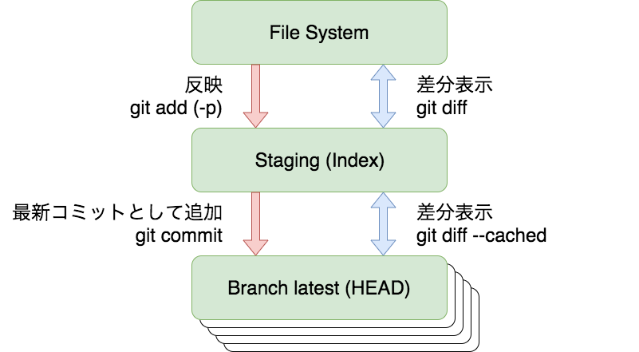
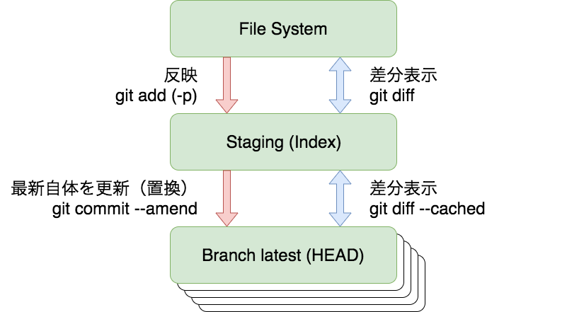

# バージョン管理とGit、GitHub、プルリクエスト

## What's New

* バージョン管理対象について、口頭で行った追加の説明などを追記
* コミットログの長さについて口頭で行った説明を記載
* エディタによる自動的な変更について記載を少々追加
* 「GitとGitHubの違い」について質問いただいたので説明を追加
* ステージングについて説明が不足していたので、口頭で行った説明と図を追加
* ステージングの意義について質問いただいたので説明を追加
* ステージングの説明のおまけとして、 `git commit --amend` の説明を追加
* Gitの内部構造について、説明をかなり端折ってしまっていたため追記
* 演習へのアクセスが簡単にできるよう、演習は別ファイルに分割
* 演習内の手順がわかるように画像を追加
* 演習内のPull Requestの送信手順を少し詳細化
* 演習内のgit pushのコマンド例が間違っていたので修正
* その他細かい表現の修正や改善をちらほら

詳細は [weathernews/dit-trainingのコミット履歴](https://github.com/weathernews/dit-training/commits/master) を参照。

## 概要

いきなりですが、初回はバージョン管理についてお話します。
単なる道具という見方もあるかもしれませんが、
エディタと並んでプログラムを書く人間が知っておくべき重要な道具であり、
たとえプログラムを直接書かない立場になっても開発マネジメント等に使う道具です。
大学でプログラミングを学んでも、その道具として学ぶことはあまりなく、
使ったことがない人もいます。
まずは全体感や考え方をお話し、その上でハンズオンで手を動かします。

### 本日お話すること

* 何のためにバージョン管理するのか？
* バージョン管理とバックアップの違い
* GitとGitHub
* バージョン管理に関わる用語
* バージョン管理の流れ
* コミットとステージング
  * ステージングの意義
* 使う上での考え方、ベストプラクティス
  * 何をバージョン管理対象とすべきか？
  * いつからバージョン管理すべきか？
  * どんなコミットをすればよいのか？
  * コミットする粒度は？
  * ファイル全体に渡る変更は？
  * コミットログにはどんなことを書けばいいのか？
  * コミットログの長さは？
  * コミットログの書き方の工夫
  * コミットログは英語で書かないといけないのか？
* その他細かいトピック
  * 一時的に変更を戻したい
  * パスワードをコミットしてしまった場合など、過去を改変したい場合は
* おまけ：Gitのデータ構造
  * ハッシュ
  * ブロックチェーンのデータ構造との類似性
  * 設計上の得意・不得意

## バージョン管理を一言でいうと？

適当なタイミングで一連のファイルのスナップショットを変更履歴として残す、
という作業を継続的に行い、あとから履歴の俯瞰や探索ができるようにすること。

## 何のためにバージョン管理するのか？

バージョン管理をすると、次のようなことが可能になる。
本格的な開発においては次のようなことをしたいため、バージョン管理するともいえる。

* プログラムを書いているときに、どこをどのように変更したか簡単に確認できる
  * 必要に応じて、元々のバージョンに戻せる
* 一つのプログラムの様々な部分を他人と同時並行で開発できる
* 他人と開発するときに、自分の行った変更が適切かを他人にチェックしてもらえる
* どのような意図でどのようにプログラムを変更したか、後から履歴を俯瞰できる
* 変更後に問題が見つかった場合、その問題のある変更がいつ入ったのかがわかる
* リリースしたすべてのバージョンの運用システムのソースコードを参照できる
* 機能開発中にバグを見つけたときに、一旦開発の手を止めてまずバグ修正だけを済ませ、また開発に戻れる

一旦バージョン管理に慣れてしまうと、バージョン管理せずにプログラムを書くことが怖くなる。
開発チームの中で、たとえプログラムをあまり書かずコードレビューしかしない立ち位置であっても、
バージョン管理は使えたほうがよい。

##### 考えてみよう！

100行のプログラムならまだいい。
先輩たちが作った、1000行のファイル20個、つまり合計20000行のソースコードから成るプロジェクトに、新たな機能を加えることになった。
お客さんのメールアドレスや社名の他に、住所も登録できるようにしたいとする。
入力欄に住所を加えないといけないし、データベースにも住所の項目を作らないといけない。
表示欄も変更が必要。
そんなときに、バージョン管理なしで開発できるだろうか……？

## バージョン管理とバックアップの違い

バージョン管理はバックアップとしても使えるが、両者は少し違う。

* バックアップ
  * 目的：
    * システムが物理的に壊れたときに復元・復旧できるようにする。
    * 大きな変更により予想外の結果になってしまったときに、復元・復旧できるようにする。
  * 手法：
    * 定期的に自動的に対象全体のスナップショットに時刻の名前をつけて保存する。
    * or 手動で対象全体のスナップショットを保存する。
* バージョン管理
  * 目的：
    * あとから変更の内容や意図を俯瞰する。
    * あとから変更の内容や意図を探す
  * 手法：
    * 論理的にまとまった変更が終わったときに、その変更内容 (what) を、説明文 (why) と時刻 (when) と一緒に保存する
* 違い
  * バックアップは主に時間単位で管理し、復元を支援する
  * バージョン管理は主に論理的な変更の単位で管理し、変更履歴の俯瞰や探索を支援する

## GitとGitHub

バージョン管理のための道具として、社内ではGitとGitHubを使うことが多い。
両者の名前は聞くけど違いがわからないという人もいるので、まずはそれぞれ何なのかを説明する。

* Git：バージョン管理ソフトウェア
  * Linuxを作ったLinus Torvaldsが、
    Linux開発に使える高速なバージョン管理システムとして、2週間ほどでコア部分を作った。
  * 日本人のJunio C Hamanoさんがメンテナンスしている。
  * Linuxの開発やGit自身の開発にはGitが使われているが、
    GitHubはミラーとしてしか使われていない。
* GitHub：Gitを使ったソフトウェア開発の場を提供するサービス
  * Windowsを開発しているMicrosoftによって買収された。
  * 日経が買収に関する記事の見出しに、
    GitHubの説明として「設計図共有サイト」という表現を使ったことで話題になった。
  * 同様のサービスにGitLabもある。

## バージョン管理に関わる用語

バージョン管理に関わる用語。
厳密にはGitの用語。Git以外でもほぼ共通のはず。

### 基本操作やデータに関連するもの

* リポジトリ：
  過去の履歴の収まったデータベース。
* コミット：
  変更内容をデータベースに登録すること、あるいは登録されたスナップショット（前のスナップショットとの間で変更されていないファイルもすべて含めて）。
* コミットログ（コミットメッセージ）：
  コミットにつける説明文。
* チェックアウト：
  リポジトリから特定のコミットを取り出して一連のファイルとして展開すること。

### 履歴関連のもの

* ブランチ：
  途中で分岐していく複数のタイムライン（パラレルワールドみたいなもの）。
* マージ：
  複数のブランチを1つのブランチにまとめること。
* タグ：
  リリースなどを特定できるよう、特定のコミットにつけたラベル。

### 他人のリポジトリとのやりとりに必要なもの

* プッシュ：
  手元のリポジトリでの変更内容を他のリポジトリに押し込むこと
* プル：
  手元のリポジトリに他のリポジトリの変更内容を引っ張り込むこと
* プルリクエスト：
  プルして！（私の変更内容を取り込んで！）というリクエスト

## バージョン管理の流れ

### ケースA：自分ひとりで開発する場合

1. リポジトリを作る
2. 管理したいファイルを管理対象にしてコミット
3. ファイルの追加や編集をしてコミット
4. 3の繰り返し

場合によってはファイルの名前を変えたり、削除したりするかもしれないけど、
まぁとりあえずはこんな感じ

### ケースB：他人のリポジトリを使う場合

1. クローンする
2. 自分の作業用のブランチを作成する
3. 必要に応じて変更を取り込み、自分のブランチにマージする
4. ファイルの追加や編集をしてコミット
5. 3〜4の繰り返し
6. 変更内容を他人に共有し、プルリクエストを出して、チェックを経て取り込んでもらう
7. 2〜6の繰り返し

### 編集〜コミットの流れをイメージできるように！

いきなり全部はむずかしいので、まずは編集してコミットを！

1. src/hello.pyを編集する
2. git status
3. git diff
4. git add src/hello.py
5. git status
6. git diff
7. git diff --cached
8. git commit -m 'Capitalize the output message'
9. git log

（多分、何回か手を動かさないと慣れないので、手を動かしてみましょう）

## コミットとステージング

Git特有の考え方として、ステージングというものがあります。

* コミットしたい内容をステージングするためのコマンド：`git add`
* ステージング内容を新たなコミットとして登録するためのコマンド：`git commit`
* 現在の（ユーザが目にする）ファイル群とステージングの差分をとるコマンド：`git diff`
* ステージングと最新コミットの差分をとるコマンド：`git diff --cached`

RCSやCVSやSubversion等、昔のバージョン管理システムを使っていた場合、ステージングに少し戸惑うかもしれませんが、次のような図をイメージするとよいです。

### ステージングの意義

すでにリポジトリ内に存在するファイルであれば、
ステージングをせずにコミットするやり方もあります。
しかし、ステージングを使うことを覚えておき、使う癖をつけておいたほうが無難です。

ステージングを使う利点は、基本的にはこれに尽きます：
**「コミットする内容を事前に最終確認できる」**

具体的には下記のような点です。

* 「コミットしたけど、ファイル○○の追加を忘れていた」など、コミット内容の間違いを防ぎ、
  つまらない間違いを修正するための追加コミットのような無駄なコミット、
  レビューしにくいコミットを減らす
  * 「以前のコミットを修正する」で後述しますが、
    Gitには過去のコミットを修正する機能がたくさんあります。
    これらも、「レビューにとって邪魔な余計なコミットを減らして、
    レビューアが本来見るべき変更に集中できるようにする」ためのものといえます。
* ファイルを少しずつコミット対象にできる。
  * 開発行為というのはすんなりいかないものなので、ローカルファイルにはたいていの場合、
    本来コミットしたい内容以外に、
    別の修正、試行錯誤の残骸、途中までおこなった変更、書きかけのドキュメントなど、
    コミットからは除外すべきさまざまな変更が含まれています。
    ステージングを通すことで、何がコミット対象で何がコミット対象でないかを確認できます。

## 使う上での考え方、ベストプラクティス

### 何をバージョン管理対象とすべきか？

#### 基本方針

基本方針：**「リポジトリ内のもので一通り完結できるようにする」**

「一通り」とは、たとえば、次のようなことが必要となることが多い。

* ソースコードのビルド
* 必要なデータ変換、プログラム自動生成の実施
* ドキュメントの生成
* テスト

PythonとJavaScriptから始めた人々には「プログラム自動生成」といっても、
あまり実感が湧かないかもしれない。
たとえば、CやJavaで書かれたプログラムのコンパイル、
TypeScriptなどのaltJS言語を使って書かれたプログラムのJavaScriptへの変換、
などを意味する。

#### 原則的に管理すべきファイル

* ソースコード
* ドキュメント（のソース）
* 変換や自動生成の入力として使われるファイル
* テストコード
* テストに用いられるデータ

#### 原則的には管理しなくてよいファイル

* サードパーティーのプログラム
* 変換プログラム、自動生成プログラムによって機械的に作られたファイル
* 重すぎるデータファイル

#### 原則を適用すべきか迷う特殊ケース

* データサイエンスのプロジェクトでの重いデータの管理
* サードパーティーのプログラムを改変して使っている場合
* 自動生成や変換に使うソフトウェアのバージョンによって、
  自動生成結果が変わりそうなので、自動生成したものも
  念のため管理しておきたい

#### 特殊ケースへの対応方針の例

あくまで例だが：

* 重いデータ⇒
  バージョン管理システムに固執せず、
  tarballやzipなどのアーカイブとして
  共有ストレージ（Windowsファイル共有（SMB）、Google Drive、AWS S3、等）
  に置くという選択肢をとる
* 自動生成結果や変換結果⇒
  1つのリポジトリに固執せず、別のリポジトリに分けるという選択肢をとる
  * 同じリポジトリで管理すると、人間の手編集と機械による自動生成結果を
    二重に管理してしまうことになり、煩雑になる
  * 機械により自動生成されたプログラムなどは、
    人間が読みにくかったり量が膨大だったりすることがあり、
    同じリポジトリに突っ込むと、人間には意味のないコミットやファイルが増えてしまう
  * たとえば、GitHub上でサイトを公開している場合、
    ソースはプログラムと一緒に管理、公開用にビルドしたものは別リポジトリ管理、
    としていたりする

### いつからバージョン管理すべきか？

自分は、
**全体の流れが一通り出来上がるか、あるいは特定の機能だけしっかり作った段階**
からきちんとコミットし始める。
もちろん、ソースコードができる前でもドキュメント等があれば、
それらは管理していく。

開発初期は、ひたすらプログラムを追加していくのみで、
コードの一部を大きく書き換えたりすることはないはず。
「○○を実装」など細かくコミットしているときりがなく、
勢いをもって全体を大まかに作り上げることが重要だと自分は考えるので。

### どんなコミットをすればよいのか？

#### 基本原則

**「レビューがしやすくなるように」**

他人が見たり、あとで自分が見たときにわかるようにコミットする。
『リーダブルコード』の「読みやすいプログラムを書く」のと同じ考え。

#### 大まかな具体方針

* ○：論理的な単位でのコミット
  （「機能Aを追加」「文字化けするバグを修正」など）
* ×：日付、時間ベースでのコミット
  （「今日はここまで」など）

後者は、最初に説明したように「バージョン管理」というより「バックアップ」。
「昨日はここまで作ったけど、今日問題点に気づいて全体的に書き直し」とか、
あるよね（長期的にはそういうのはあっても仕方ないけど）。

#### 中途半端なコミットはダメなのか？

中途半端でも、論理的な単位になっていてレビューしやすければよい。

「まずは全体の流れを作成」（そのあとで「機能1を実装」）などなら、わかりやすい。

### コミットする粒度は？

小さすぎず、大きすぎず、がよいと個人的には思う。

小さすぎると、コミットの頻度が高すぎて無駄が多い。
「3行書いた。はいコミット」などとやっていたら、
たぶん時間の1/3くらいはバージョン管理に費やしてしまうことになる。
それに、レビューする人にとっても全体が見えにくい。

大きすぎると、全体は見えやすいけどレビューするのが大変。
10000行の変更をくまなくチェックするのは厳しい。

もっとも、たとえばtypoの修正のようなものなら、1行でも問題ない。
変更すべき箇所がそれしかないのだから仕方がない。

### ファイル全体に渡る変更は？

当然ながら、同じ場所を複数人で変更すると、競合し、お互い不幸になる。
人とかちあう変更は、システムでは解決できないので、人間で調整を。

#### エディタによる変更に注意！

基本方針：**「意図した差分のみがコミット対象になっているか、コミット前に必ずチェックする」**

「エディタの機能で、ファイル内の行の末尾の空白がすべて削除されてしまい、
差分が巨大になってしまった」
というケースがある。
そうでなくても、意図しない変更をコミットに含めてしまったり、
意図した変更をコミットに含め忘れてしまったりすることはよくある。
コミット前に自分で確認するのは、常に重要。

コードのフォーマットを全体的に直すことも時には必要。
しかし、上記のようにファイル全体に及ぶ変更となるので、
普段の機能追加やバグ修正とは分けて、
別の機会に、全員が足並み揃えてOKなときにやること。

### コミットログにはどんなことを書けばいいのか？

#### "Update foo.py"?

gitというコマンドの使い方を説明しているサイトは巷にあまたあれど、
コミットログにどんなことを書けばよいのかの説明は、あまり見かけない。
巷の例にあるコミットログは「Update foo.py」など一言書かれているだけのものが多い。

基本方針：**「差分を見て簡単にわかる（けど背景の理解には繋がらない）ことは書かない」**
* 「どのファイルを変更したか」など

「Add foo.py」
「Update foo.py」
は基本的には避けたい。

#### whatよりwhyを

プログラムを書くときには、コメントとして、whatよりもwhyを書いたほうがよい。

「何故こんなtrickyなことをしているのか？（使っているライブラリの問題を回避したい、など）」
「何故このテストを追加したのか？（昔のこのバグが再発しないか確認したいので、など）」

同じように、コミットログにもwhyを書いてあげたほうがよい。

### コミットログの長さは？

必要であれば、長くてもOK。プロジェクト次第。

たとえばLinux kernelのソースコードのコミットログでは、
背景やコマンドの実行例のようなもの、ほかのメンバーのコメントの引用などまで書かれる。
彼らはコミュニケーションの道具としてGitHubを使っておらず、
専らメールでのやりとりをしている。
そのため、メールでの議論をコミットログにまとめるため、コミットログが長い。

例：
https://github.com/torvalds/linux/commit/3f36d8669457605910cb7a40089b485949569c41

他方で、GitHubやGitLabを使っている場合、
バグはGitHubのissueとして報告され、管理されるし、
機能強化などの議論もGitHubのissueを立てて進められる。
GitHubではコミットログにissue番号を書くと自動的にリンクを張ってくれるなどの機能もあるので、
基本的にはコミットログは短く、issue番号を記載して詳細はそちらに任せることが多い。

例：
https://github.com/pandas-dev/pandas/commit/9d45934af87ce4bdf204836a2e9cfcc3a7e5c279

#### 複数行に渡るコミットログの書き方

1行目：サマリ。
gitでは1行目はメールのSubjectに相当するものとして扱われる。
（メールで送信できるよう、メールに変換する機能もあり、その場合は1行目がSubjectとして使われる。また、1行目だけをずらずら並べる表示もできる。GitHubでも1行目だけは特別視される）
なので、1行目だけは次の行に跨がらないほうがよい。

2行目：空行。
サマリと本文を分けるため、明示的に空行を入れることが多い。

3行目〜：本文。

◆参考文献：[Pro Git 5章](https://git-scm.com/book/ja/v2/Git-での分散作業-プロジェクトへの貢献)

### コミットログの書き方の工夫

コミットはさまざまな変更が含まれるが、大体いくつかのカテゴリに分けられる。

* 機能追加
* バグ修正
* クリーンアップ（動作への影響はない）
* ドキュメント整備
* テスト追加
* ：

たとえサマリ行だけの表示にしても、大量にコミットがあるときにすべての自然言語を読み解いて
これらのどれに相当するのか頭の中で整理していくのは大変である。
世の中にはこの作業を簡単にするため、コミットログの先頭にそれらを区別する文字を入れているプロジェクトが存在する。

たとえばpandasではこんなコードを頭に入れるルールにしている。

* ENH: Enhancement, new functionality
* BUG: Bug fix
* DOC: Additions/updates to documentation
* TST: Additions/updates to tests
* BLD: Updates to the build process/scripts
* PERF: Performance improvement
* CLN: Code cleanup

XXX: こちらのURLを参照
XXXこちらのコミットログを参照

たとえばatomではこんな絵文字を頭に入れることを検討するよう定めている。

XXX: CONTRIBUTING.md参照
XXXこちらのコミットログを参照

コミットログは、みんながバラバラに書くと乱雑感が出てしまうが、
（日本語/英語、capitalizeする/しない）
ちょっとガイドラインを定めると見やすくなるので、
こういったものを参考に、チームで何かガイドラインを定めてもよいのでは？

### コミットログは英語で書かないといけないのか？

技術的には言語の制約はないので、チーム内のルールに従うのがよい。
文字コードには制約があり、日本語やその他の言語を使う場合、UTF-8にしておくのが無難。

個人的な意見：

* 開発チーム内のコミュニケーションに使う言葉が英語でなければ、
  コミットログを英語で書く必要はない。
* 英語で書いたほうが英語の練習になるとは思う。
* とはいえ、語彙が少なく、書きたいことがうまく表現できずに「Add ...」「Change ...」の
  繰り返しのようになってしまうくらいなら、
  あるいは英語の表現をブラッシュアップするのに時間をかけすぎるくらいなら、
  日本語で書いたほうがよい。

## その他細かいトピック

### 一時的に変更をsaveしたい

（省略。。。）

### 以前のコミットを修正したい

* パスワードなどをコミットしてしまった
  （たとえ最新版から消しても、履歴として永久に残る）
* コミットした内容に含まれるtypoなどつまらない修正は、
  他人に見てもらう前にメインのコミットに取り込んでしまい、
  レビューしてもらいやすくしたい
* ファイルの変更はコミットしたが、
  一緒にコミットすべきファイルの追加を忘れていた。
  2つ合わせて変更として意味を成すので、できれば1つにまとめてしまいたい
 
方法は色々ある：

* git reset HEAD~
* git commit --amend
* git rebase -i
* git filter-branch

など、「歴史を改変する」手段は色々とあるけど、最初にいきなり覚えるのは大変だし、
これらのコマンドまで間違えてしまうと対応が大変なので、
慣れたら覚えていきましょう。

https://qiita.com/muran001/items/dea2bbbaea1260098051

前述のステージングのイメージとも関係があるので、`git commit --amend` だけ簡単に説明します。

* `git commit` は現在のステージング内容を新たなコミットとして登録するコマンド
* `git commit --amend` は、現在のステージング内容で最新コミットを置き換えるコマンド

重要な原則：

* 自分のローカルにしかないコミットであれば、
  いくらでも変更をまとめたりして問題ありません
  むしろ、他人がレビューしやすくするために手直しを推奨します
* 他人にすでに共有した変更については、
  履歴をいじるのは他人にも影響を及ぼすので、
  原則はやらない。やるなら必ず事前に確認して、全員が都合のよいタイミングで行う。
* パスワードなど、履歴に残してはいけないものをコミットしてしまった場合は、
  その限りではない（全員の履歴から削除すべき）。
  強いて言えば、共有（プッシュ、マージ）の前に必ずチェックするべき。

### アドバイスは？

#### 目に見えないものをイメージする

おそらく最初戸惑うのは、次のような、目に見えなものの切り替えのはず：

* ブランチ
* ユーザが実際に目にするファイルと、ステージング、そしてブランチの最新版（`HEAD`）という3つの状態

`git diff`、`git diff --cached`、`git branch`を使って、今自分がどのブランチで何と何の差分を見ているかイメージを持つのが大切。
これらをしっかりと意識できれば、おそらくはすぐに使いこなせる。

#### とにかく遊んでみる

ローカルで勝手にリポジトリを立て、ブランチを切り替え、様々な変更を加える分には誰も迷惑しない。また、GitHubにプッシュしても、プライベートリポジトリであれば社外の人には見えない。所詮普通のファイルなので、要らなくなったらディレクトリごと消せばよい。とにかく遊んで慣れる。

## おまけ：Gitのデータ構造

Gitのこのような機能は、実は「ハッシュ木」という非常に単純なデータ構造で実現されている。
このデータ構造ではこうなっている（参考文献の絵を参照）。

* すべてのコミット、すべてのツリー（管理されているファイルリスト）、すべてのファイルには、ハッシュという一意な名前がつけられている。
* ファイルは、更新されれば別の名前（ハッシュ）で登録されるし、前のバージョンと同じであれば前のバージョンと同じ名前がつく。
* すべてのコミットは、親となるコミットへの参照がつけられている。マージコミットの場合は親コミットは複数存在する。
* すべてのコミットは、そのコミットに紐づくツリーを参照し、ツリーは、そのツリーに含まれるすべてのファイルのバージョンを参照している。

インタフェースとして管理されているのは、「各ブランチの最新のコミット」のみ。最新のコミットのハッシュがわかれば、親コミットはすべて辿れる。親コミットからはすべてのファイルが参照できる。そのため、各ブランチの最新のコミットがあれば過去や変更内容はすべて辿れる。

◆参考：Pro Git 10.2 Git Internals - Git Objects ( [en](https://git-scm.com/book/en/v2/Git-Internals-Git-Objects) / [ja](https://git-scm.com/book/ja/v2/Gitの内側-Gitオブジェクト) )

### 設計上の得意・不得意

データ構造上、親をどんどんたどっていくかたちになっている。
だから、次のような特性があある。

* 新たなコミットをしたときに、親コミット側のデータは変更されない。
  その「新たなコミット」のデータを加えて、「ブランチの最新コミット」の参照を変えるだけ。
  * つまり、一度作ったデータはいじらないので、壊れにくい。
* 辿る方向は時間軸に対して逆の方向のみ。
  * 「一番古いコミット」がどれかは管理されていないし、「自分の子」はわからない。
* ツリー全体の変更履歴を追うほうが楽。
  特定のファイルの変更だけを追うのは時間がかかる。
  * 特定のファイルの変更履歴は直接辿れず、
    全体の履歴を追った上で「そのファイルが含まれているか？」を調べないといけない。

### ブロックチェーンのデータ構造との類似性

昨日、ブロックチェーンのHyde Parkがあった。
その中で、データ構造として次のようなことが言われていた。

* すべてのノードはハッシュで管理されており、前のノードのハッシュを参照するバックポインタとなっている。
* つまり、時間が進む方向とは逆方向に辿るようになっている。
* ハッシュは一意なので、計算し直せば、それが正しいかどうかがわかる。

それがまさにこれ。
ハッシュをベースにどんどん過去を辿れるのは、昨日のブロックチェーンのデータ構造と同じ。
違うのは、ブロックチェーンのほうが計算に時間がかかり、より暗号を意識している点。

このデータ構造は「ハッシュ木」と呼ばれる。

◆参考："Hash tree" in Wikipedia ( [en](https://en.wikipedia.org/wiki/Merkle_tree) / [ja](https://ja.wikipedia.org/wiki/ハッシュ木) )

### ハッシュ

データの「指紋」。どんなデータでも、一瞬で数十文字の値に変換できる。
特定のハッシュに変換できるファイルを自分で作り出すことは（基本的には）できない。
もちろんファイルは無限に存在するため、他のファイルと「指紋」が被る可能性はゼロではないが、
ほぼない。

そのようなハッシュを計算する関数（アルゴリズム）はいくつかあり、
Gitでは現在、SHA1というものを使っている。

◆参考："Hash function" in Wikipedia ( [en](https://en.wikipedia.org/wiki/Hash_function) / [ja](https://ja.wikipedia.org/wiki/ハッシュ関数) )
