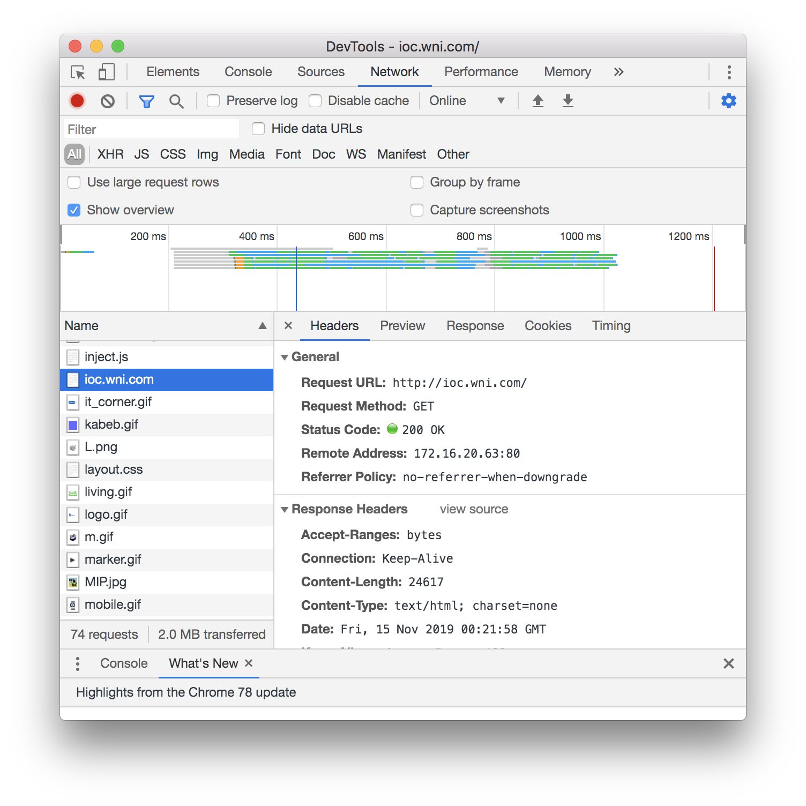

# 継続トレーニング #5：HTTPフォローアップ

## 概要

前回のフォローアップをいくつかします。

### 本日お話すること

* REST説明しなおし
* HTTPメソッド
* ヘッダのさまざまなフィールド
* ステータスコード
* URLとquery stringとpercent encoding
* Chrome上でHTTPを眺める
* PythonでURLを解析する
* PythonでURLを叩く（HTTPクライアントになる）


## REST説明しなおし

前回、「RESTfulでない」という話の中で、こんな話をした：

「ログイン状態などの状態、セッション情報をサーバ側で管理する場合、
全ユーザの状態をサーバ側で管理しないといけないから大変なので、RESTのほうがよい。」

この話はうまく説明できなかった自信があるし、おそらく10年前くらいの知識も入っているので、
フォローする。

### ログイン（というより認証・認可）はRESTfulでないのか？

「全ユーザの状態をサーバ側で管理する」ことの何が大変か？

⇒それは、サーバが1台ではないため。
実際には、サーバ1台でサービスを提供することはなく、
大量のサーバ群がサービスを提供しているため、
頻繁に変わる「状態」を管理しようとすると、サーバ群の間でデータを同期する必要が出てくる。

でも世の中でログインが必要なWebサービスは大量にないか？

⇒そのとおり。実際、世の中ではこのあたりはあまり問題にならなくなった。

ログインが必要なAPIはRESTfulではないのか？

⇒そんなことはない。
実際、たとえばGoogleなどの有名なAPIの多くが認証などが必要になってきている。
それは、前回も説明したとおり、
「使われたものの見返りがなく、サーバアクセス増加、インフラ増強によるコスト増加だけ」
になるのは避けたいという思惑があるはず。
誰がAPIのどの機能をどのくらい使ったか、というのをきちんと記録し、
利用度に応じて利用制限をかけたり、戦略などに生かすため（のはず）。

なので、最近では、
「REST」の定義において「状態の管理がない」という側面はあまり気にされなくなってきている模様。

### ではどんなAPIがRESTfulではないのか？

たとえば、次のように、実行したい関数名とデータをHTTP POSTで送るAPIはRESTfulとは言い難い。

```
POST / HTTP/1.1
{"method": "get_list_item", arg: 10}
```

これをREST風に実現するなら、こうなる。

```
GET /list/10 HTTP/1.1
```

同じように、何でもPOSTを使うAPIもRESTfulとは言い難い。

```
POST /DeleteListItem HTTP/1.1
{"id": 10}
```

これをREST風に実現するなら、こうなる。

```
DELETE /list/10 HTTP/1.1
```

あるいは、エラー時にレスポンスとして次のようなものが返ってくるAPIもRESTfulでない。

```
HTTP/1.1 200 OK
（レスポンスヘッダは省略）

{"status": "999", "reason": "No such data"}
```

これをREST風にするとこうなる。

```
HTTP/1.1 404 Not found
```

### つまりRESTとは？

要は、RESTとは、
「HTTPで定義されているメソッドやステータスコードをうまく使って、シンプルに実現しましょう」
という考え方。

HTTPは、URLにある「リソース」にアクセスするための手段。
したがって、RESTも「リソース」としてものを見る。

上のRESTfulでない例で、`/DeleteListItem`は、URLが「機能（アクション）」になっていた。
他方で、RESTfulな例では、URLは`/list/10`というリソースで、
それを削除するというアクションは、`DELETE`というメソッド名で表現されている。

参考
0からREST APIについて調べてみた
https://qiita.com/masato44gm/items/dffb8281536ad321fb08
（「RESTなAPIとそうではないAPIの例」がよい）

HTTPメソッド(CRUD)についてまとめた
https://qiita.com/r_fukuma/items/a9e8d18467fe3e04068e
どの目的にどのメソッドを使うか、という話

RESTful API設計におけるHTTPステータスコードの指針
https://qiita.com/uenosy/items/ba9dbc70781bddc4a491
ステータスコードをどの目的に使うか


### RESTにこだわりすぎないことも重要

たとえば、

* カレンダーにイベントを追加する
* カレンダーのイベントを取得する
* カレンダーのイベントを更新する
* カレンダーのイベントを削除する

といった操作であれば、RESTと相性がいい。
ただ、サービスの機能次第なので、すべてがRESTと相性がいいわけではない。

なるべくHTTPのメソッドやステータスコードをうまく使うという原則に沿いながらも、
最初に書いた「状態管理」のように、RESTと相性がよくないものでも必要に応じて使うのが大切。

## HTTPメソッド

https://tools.ietf.org/html/rfc7231

## ヘッダのさまざまなフィールド

https://tools.ietf.org/html/rfc7231


## ステータスコード

https://tools.ietf.org/html/rfc7231
https://en.wikipedia.org/wiki/List_of_HTTP_status_codes


## URLとquery stringとpercent encoding

RESTを理解する上でHTTPとURLの理解が必要ですが、
URLのほうをあまりきちんと説明していなかったので、補足説明します。

たとえば、Googleで「hoge」と検索すると、このようなURLになります。

https://www.google.com/search?q=hoge&oq=hoge&aqs=chrome..69i57j69i65.307j0j1&sourceid=chrome&ie=UTF-8

`?`以降は、query stringと呼ばれます。
これらはURLの引数として与えられたパラメータで、
`key1=value1&key2=value2`のように、
キーと値が連なった形式（Pythonでいうと「辞書」のようなもの）となっています。

https://en.wikipedia.org/wiki/Query_string

同じように、Googleで「Webを支える技術」と検索すると、このようなURLになります。

https://www.google.com/search?sxsrf=ACYBGNSo-zoyu4vMSWG1RGVdsmSzWWfD-w%3A1573778237467&source=hp&ei=PfPNXeemGrCzmAX88regDw&q=Web%E3%82%92%E6%94%AF%E3%81%88%E3%82%8B%E6%8A%80%E8%A1%93&oq=Web%E3%82%92%E6%94%AF%E3%81%88%E3%82%8B%E6%8A%80%E8%A1%93&gs_l=psy-ab.3..35i39j0i4i37i32l7.1307.1307..1524...0.0..0.86.160.2......0....2j1..gws-wiz.....10..35i362i39.0OBLYMf8-bg&ved=0ahUKEwinubDm_OrlAhWwGaYKHXz5DfQQ4dUDCAY&uact=5

これは、「URLエンコーディング」「パーセントエンコーディング」などと呼ばれます。
URLに入れられる文字は決まっているので、そこに入らない文字はすべてこのように別の文字に置き換えられます。

上のquery stringの話を考えればわかるでしょう。
`?`は、URLの本体とquery stringの区切りとして使われると決まっている文字です。
同じように、query stringのキーと値を区切るという役割が`=`や`&`にもあります。
こういった文字が他の部分にも入っていたら、機械的に処理できませんよね。


## Chrome上でHTTPを眺める

前回はcurlコマンドでHTTPのヘッダやステータスなどを眺めましたが、
ChromeのDevToolsでも見られます。



（JavaScriptのプログラミングで使ったことがある人もいると思います。）

## PythonでURLを解析する

PythonのURLとクエリパラメータのパースまとめ
https://qiita.com/yagays/items/e59731b3930252b5f0c4
URLからquery stringを取り出してpercent-encodingから普通の文字列に直したり、
逆に普通の辞書をquery stringに変換したり。

## PythonでURLを叩く（HTTPクライアントになる）

https://note.nkmk.me/python-requests-usage/
