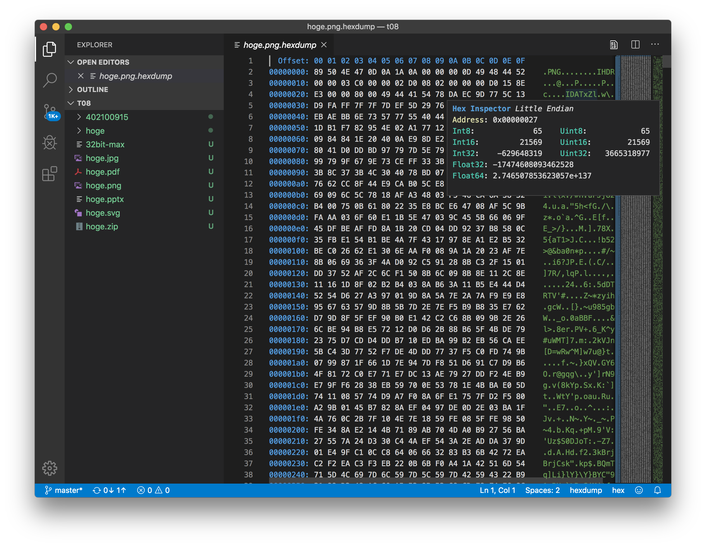

# 継続トレーニング #8：さまざまなデータフォーマットとファイル操作 (3)

## 概要

前々回、前回に続き、今回もさまざまなデータフォーマットとファイル操作のお話をします。
前回まででテキストファイル系は一通り説明したので、今回はバイナリファイルまわりを説明します。

前回同様、どの言語でも共通で知っておくべき一般的な話を中心にしながら、
必要に応じて言語特有の方法に触れていきます。

### 本日お話すること

* バイナリの種類
  * 世の中一般で広く使われるファイルフォーマット
  * 気象業界などで使われるファイルフォーマット
  * バイナリファイルとテキストファイルの読み込み効率
  * シリアライズとデシリアライズとデータ交換
  * Pythonでのシリアライズ、デシリアライズ
  * 配列（リスト）データ
  * メタ情報
* バイナリを観賞する
  * マジックナンバー
* フラットバイナリ
  * バイト単位での読み込みと書き出し
  * バイトオーダー、ビッグエンディアン、リトルエンディアン
  * Cの型の知識
  * pack
  * NumPyの場合
* RU (ReUsable)
  * PythonでのRUのパース
  * PerlでのRUのパース

## バイナリの種類

バイナリ (binary) といっても身のまわりには色々ある。

### 世の中一般で広く使われるファイルフォーマット

* MS Officeのファイル：`.doc`, `.docx`, `.xls`, `.xlsx`, `.ppt`, `.pptx`
* PDF
* ほとんどの巷のアプリケーションプログラムや共有ライブラリ
* 圧縮ファイル（`.zip`など）
* ほとんどの画像や動画のファイル（`.png`, `.jpg`, `.gif`, `.webp`, `.mp3`, `.mp4`, `.webm`など）

（イメージしやすいよう拡張子を例示に使っていますが、拡張子なんて飾りです。）

今回は、これらのファイルのうち、データを読み込んで処理する、
という目的で社内でよく使われるものを取り上げる。

### 気象業界などで使われるファイルフォーマット

科学の世界や気象業界や社内に限って言うと、さらに色々なものがある。

* フラットバイナリ
* HDF (Hierarchical data format)
* 気象、海洋、気候変動などの分野でよく使われるフォーマット：NetCDF
* 気象業界のフォーマット：BUFR, GRIB, GRIB2
* ReUsable

### バイナリファイルとテキストファイルの読み込み効率

いずれも主な目的は、大量のデータを効率よく格納する、というところにある。
[以前](t06-data-formats.md)も書いたように、
同じ数値の4,294,967,295という数値をデータとして保存するのでも、
テキストデータとして保存するのと32ビットの整数のバイナリデータとして保存するのでは、
ファイルサイズがかなり異なる。
それ以上に、プログラム内で数値として使いたいデータをテキストファイルから読み込む場合、
**テキストから数値に変換しないといけない**。

たとえば、4,294,967,295という32ビット符号なし整数の最大値だけを含んだファイルを考える。
デジタルの世界では、ファイルの中身は0と1の羅列（2進数）である。
バイナリデータとして保存したファイルとテキストデータとして保存したファイルそれぞれの、
中身はこんな感じになっている。

(A) バイナリデータとして保存したファイル：

```
11111111 11111111 11111111 11111111
```

(B) テキストデータとして保存したファイル：

```
00110100 00110010 00111001 00110100 00111001 00110110 00110111 00110010 00111001 00110110
```

（なお空白は見やすくするために入れている）

これを`4294967295`という数値として使いたい場合、
メモリ上には次のように格納する必要がある。

```
11111111 11111111 11111111 11111111
```

つまり、(A)なら変換せずにそのままメモリに読み込めるが、
(B)の場合、変換しないといけない。
すべての数値をこのように変換するのがいかに大変か、想像できるだろうか。

なお、「JSONは型があるので、その点ではスキーマなしのXMLよりも優れている」
という話を[この前](t07-data-formats-2.md)した。
とはいっても、JSONはテキストファイルなので、
中に含まれている数値は(B)のかたちで入っている。
したがって、
「`"4294967295"`なら文字列として読み込む」
「`4294967295`なら数値として読み込む」
とプログラムは自動判別できるものの、
両者はデータとしてはほぼ同じ（`"`で囲まれているか否か）で、
**数値の場合にプログラムの内部で変換が必要になることには変わりない**（ので、
読み込み時の効率ではバイナリには遥かに劣る）。

なお、書き出しに関しても同様である。

ハンズオン：
* 演習1：JSONをバイナリデータとして眺めてみる

### シリアライズとデシリアライズとデータ交換

前述のように、主に他のプログラムとの交換を目的として、
プログラム内部のデータをファイルに保存できるようなかたちに変換することを
**シリアライズ (serialization)** といい、
その逆変換を **デシリアライズ (deserialization)** という。
詳しく知りたければGoogle検索をどうぞ。

1つの数値だとわかりづらいが、
たとえばプログラム内の大きな辞書データや配列（リスト）、
あるいは何らかのオブジェクトを保存することをイメージするとよい。
そういうものをファイルに保存するには、バイト列に変換する必要がある。

保存用のフォーマットとしてはXMLやJSONのようなテキストフォーマットでもいいし、
バイナリフォーマットでもよい。
出力プログラムと出力データを読み込むプログラムでお互いに認識が合っていれば問題ない。

また、ファイルに書き出すこと自体がシリアライズではない。
ファイルに書かなくても、ネットワーク等でデータのやりとり（データ交換）する必要があれば、
そこでシリアライズが発生する。

例1：
```
--program A--
内部データ
　↓
（シリアライズ）
　↓
（ファイル書き出し）
-------------
　↓
hoge.xml
　↓
--program B--　←後日起動した別のプログラム
（ファイル読み込み）
　↓
（デシリアライズ）
　↓
内部データ
-------------
```

例2：
```
--program A--
内部データ
　↓
（シリアライズ）
　↓
（プロセス間通信でのデータ送信）
-------------
　↓ ←ファイルの書き出しは行われていない
--program B--　←同じタイミングで起動している別のプログラム
（プロセス間通信でのデータ受信）
　↓
（デシリアライズ）
　↓
内部データ
-------------
```

例3：
```
--program A--　←たとえばWebブラウザ
内部データ
　↓
（シリアライズ）
　↓
（ネットワーク送信）
-------------
　↓
--program B--　←たとえばWebサーバ
（ネットワーク受信）
　↓
（デシリアライズ）
　↓
内部データ
-------------
```

シリアライズとデシリアライズは、
特にPython、R、Javaなど様々な言語のシステムで大量のデータのやりとりをする、
データ分析や機械学習の世界で大きなボトルネックとなりがちである。
でもその話はまたいつの日か。

### Pythonでのシリアライズ、デシリアライズ

Pythonには、
シリアライズのフォーマットおよびモジュールとして[pickle](https://docs.python.org/ja/3/library/pickle.html)が用意されているので、
ちょっとしたことにはこれを使うのがよい。
高速に読み書きできて便利である。
ただ、多言語とのやりとりには使えないのと互換性に関して制約はあるので、
あくまで一時的なデータの保存を目的とした利用がよい。

ハンズオン：
* 演習2：pickleを使ってみる

### 配列（リスト）データ

「科学の世界や気象業界や社内」のバイナリデータとして挙げたフォーマットの中で、
特に以下のデータフォーマットには共通点がある。

* フラットバイナリ
* 気象、海洋、気候変動などの分野でよく使われるフォーマット：NetCDF
* 気象業界のフォーマット：GRIB, GRIB2

「配列」である。

数値流体力学などの数値計算では、
空間を格子状に区切ってシミュレーションをするようなことが多い。
そうすると、データとしては2次元配列や3次元配列をよく使う。
たとえば2次元平面の気温の分布を表すのであれば、数値の2次元配列が必要になる。

プログラムの終了時に「状態」を残しておき、あとで使えるようにするため、
こういった配列を保存しておく必要がある。
その際に無駄を省くため、上記のようなバイナリフォーマットが使われる。


## バイナリを観賞する

バイナリは、テキストフォーマットではないので、
ふつうにテキストエディタやブラウザなどで開くと意味不明な表示となる。
それが何となくとっつきにくい感じを与えているが、親しんでみるとなかなか面白い。
親しむには、とにかく眺めてみるのがよい。

さまざまなエディタにバイナリを表示できるモードが用意されているので、
それらを使うのがよい。

まずはシンプルにコマンドラインで表示する方法として、`od`と`hexdump`がある。

```
noritada[3:36]% od -tx1 -Ax t08/hoge.png | head
0000000    89  50  4e  47  0d  0a  1a  0a  00  00  00  0d  49  48  44  52
0000010    00  00  03  c0  00  00  02  d0  08  02  00  00  00  d0  15  8e
0000020    e3  00  00  80  00  49  44  41  54  78  da  ec  9d  77  5c  13
0000030    d9  fa  ff  7f  7f  7d  ef  5d  29  76  77  75  db  dd  be  ab
0000040    eb  ae  bb  6e  73  57  77  55  40  44  b1  f7  de  1b  2a  8a
0000050    1d  b1  f7  82  95  4e  02  a1  77  12  7a  09  bd  13  5a  08
0000060    09  84  84  1e  20  40  0a  e9  8d  e2  fe  ce  cc  81  18  93
0000070    80  41  d0  dd  bd  97  79  7d  5e  79  4d  26  99  99  53  9e
0000080    99  79  9f  67  9e  73  ce  ff  33  3b  1c  a9  ab  85  3a  32
0000090    3b  8c  37  3b  4c  30  40  78  bd  07  7c  1d  d2  48  1b  94
noritada[3:36]% hexdump -C t08/hoge.png | head
00000000  89 50 4e 47 0d 0a 1a 0a  00 00 00 0d 49 48 44 52  |.PNG........IHDR|
00000010  00 00 03 c0 00 00 02 d0  08 02 00 00 00 d0 15 8e  |................|
00000020  e3 00 00 80 00 49 44 41  54 78 da ec 9d 77 5c 13  |.....IDATx...w\.|
00000030  d9 fa ff 7f 7f 7d ef 5d  29 76 77 75 db dd be ab  |.....}.])vwu....|
00000040  eb ae bb 6e 73 57 77 55  40 44 b1 f7 de 1b 2a 8a  |...nsWwU@D....*.|
00000050  1d b1 f7 82 95 4e 02 a1  77 12 7a 09 bd 13 5a 08  |.....N..w.z...Z.|
00000060  09 84 84 1e 20 40 0a e9  8d e2 fe ce cc 81 18 93  |.... @..........|
00000070  80 41 d0 dd bd 97 79 7d  5e 79 4d 26 99 99 53 9e  |.A....y}^yM&..S.|
00000080  99 79 9f 67 9e 73 ce ff  33 3b 1c a9 ab 85 3a 32  |.y.g.s..3;....:2|
00000090  3b 8c 37 3b 4c 30 40 78  bd 07 7c 1d d2 48 1b 94  |;.7;L0@x..|..H..|
```

また、Emacsだと`hexl-mode`が使える。`M-x hexl-mode`でモードに入り、
`M-x hexl-mode-exit`で抜ける。

```
00000000: 8950 4e47 0d0a 1a0a 0000 000d 4948 4452  .PNG........IHDR
00000010: 0000 03c0 0000 02d0 0802 0000 00d0 158e  ................
00000020: e300 0080 0049 4441 5478 daec 9d77 5c13  .....IDATx...w\.
00000030: d9fa ff7f 7f7d ef5d 2976 7775 dbdd beab  .....}.])vwu....
00000040: ebae bb6e 7357 7755 4044 b1f7 de1b 2a8a  ...nsWwU@D....*.
00000050: 1db1 f782 954e 02a1 7712 7a09 bd13 5a08  .....N..w.z...Z.
00000060: 0984 841e 2040 0ae9 8de2 fece cc81 1893  .... @..........
00000070: 8041 d0dd bd97 797d 5e79 4d26 9999 539e  .A....y}^yM&..S.
00000080: 9979 9f67 9e73 ceff 333b 1ca9 ab85 3a32  .y.g.s..3;....:2
00000090: 3b8c 373b 4c30 4078 bd07 7c1d d248 1b94  ;.7;L0@x..|..H..
```

vimなら`-b`をつけてバイナリモードで起動し、`:%!xxd`で16進数表示にする。

VSCodeには、[hexdump for VSCode](https://marketplace.visualstudio.com/items?itemName=slevesque.vscode-hexdump)という拡張が作られている。
なかなか使い勝手がよい。



### マジックナンバー

先程の例はPNGファイルを開いた例だが、
テキスト表示の先頭に「.PNG」という文字が並んでいる。
これはマジックナンバーなどと呼ばれるものであり、
フォーマットを識別するのに使われる。

バイナリはある意味「どれも同じような塊」なので、何も情報がないと識別しにくい。
もちろん最後まで読めば途中で「あれ？期待していたフォーマットではない」となるが、
パット見た段階で、何らかの方法で識別できたほうがよい。
その役割を果たすのがこのマジックナンバーである。

マジックナンバーのおかげで、たとえ拡張子などなくてもファイルフォーマットは推定できる。
そのようなことをやってくれるのが`file`コマンドである。

```
noritada[3:58]%  cp -p hoge.png foo
noritada[4:08]%  file foo
foo: PNG image data, 960 x 720, 8-bit/color RGB, non-interlaced
```

（なお、必要に応じてマジックナンバー以外の情報も読み、
たとえば画像のサイズなどを取得している。）

◆参考：
* https://ja.wikipedia.org/wiki/%E3%83%9E%E3%82%B8%E3%83%83%E3%82%AF%E3%83%8A%E3%83%B3%E3%83%90%E3%83%BC_(%E3%83%95%E3%82%A9%E3%83%BC%E3%83%9E%E3%83%83%E3%83%88%E8%AD%98%E5%88%A5%E5%AD%90)
* https://qiita.com/forestsource/items/15933888466ba9c3f048

### メタ情報

上で、「マジックナンバー以外の情報」から画像のサイズなどを取得していると書いた。
そのような、ファイルの本体に関係する属性などの情報を **メタ情報** と呼ぶ。

例：

* ラスター画像の縦と横のピクセル数
* 写真の撮影日時、撮影位置情報、撮影時のF値などに関する情報
  （日時はファイルのタイムスタンプからわかるが、
  タイムスタンプは、たとえばメールでの送信などで失われたりする）
* 気象データの格子と経緯度との対応関係

メタ情報自体はバイナリファイルに限った用語ではなく、
HTMLにも`<meta>`タグはあるが、折角なのでここに書いておく。


## フラットバイナリ

フラットバイナリとは、プレーンテキスト同様、
プログラムで処理しやすい特定フォーマットになっていない、単なるバイナリファイルである。
プレーンテキストとほぼ同じことが言えるので、
[以前の説明](t06-data-formats.md)を参照してほしい。

たとえば、中身が次のようになっているデータファイルがあるとする。

```
11111111 11111111 11111111 11111111
```

この場合、255という8ビット符号なし整数値が4つ並んでいるのか、
65,535といおう16ビット符号なし整数値が2つ並んでいるのか、
4,294,967,295という32ビット符号なし整数値が1つだけなのか、わからない。
さらにいえば、-1という8ビット符号付き整数値が4つ、-1という16ビット符号付き整数値が2つ、
など様々な可能性が考えられる。
そもそも整数とも限らない。

このように、バイナリファイル内のどこをどう読めばよいかを読み手と書き手が自由に決めてやりとりしているのがフラットバイナリである。
他方で、このあたりを、プログラムによって解釈が異ならないよう仕様を定めて一意に読み書きできるようにしているのが他のバイナリフォーマットである。

### バイト単位での読み込みと書き出し

プレーンテキストを読むときは行単位での処理ができればよいと書いたが、
フラットバイナリ含むバイナリデータ全般を読むときは、
基本的にバイト単位での処理ができればよい。

* 今いる場所から任意のバイト数を読み込む
* 特定のバイト列が登場するまで読み進める
* ファイルのNバイト目にジャンプする
* pack（後述）などで、特定のバイト列を一連の数値や文字列などとして認識させる

### バイトオーダー、ビッグエンディアン、リトルエンディアン

バイナリデータをプログラムで読むときに、注意をしなければいけない点が1つだけある。
バイトオーダーである。
一言で言うと、複数のバイトを並べるときの並べ方が異なる。
同じデータの表現が複数ある、という意味では、
文字コードみたいなものと思っておくのがよいかもしれない。

◆参考："Endianness" in Wikipedia ( [en](https://en.wikipedia.org/wiki/Endianness) / [ja](https://ja.wikipedia.org/wiki/%E3%82%A8%E3%83%B3%E3%83%87%E3%82%A3%E3%82%A2%E3%83%B3) )

> 例えば、十六進法で表現すると 1234ABCD という1ワードが4バイトのデータを、バイト毎に上位側から「12 34 AB CD」のように並べる順序はビッグエンディアン[1]、下位側から「CD AB 34 12」のように並べる順序はリトルエンディアン[2]である。

それぞれのハードウェアのパフォーマンスをうまく引き出せるようにした結果、
複数の並べ方が生まれた。
要は歴史的経緯である。
TCP/IPではビッグエンディアンに統一しており、ネットワークバイトオーダーという。
当然ながら、マシン（ホスト）のバイトオーダーがリトルエンディアンの場合はバイトの入れ替え（バイトスワップ）が必要となる。

[どちらがよいかの議論はある](https://www.quora.com/What-are-the-advantages-of-using-Big-Endian-over-Little-Endian-in-a-computer-architecture-Why-do-some-designers-decide-to-use-Big-Endian)が、
まぁ我々としては与えられたものを読むことのほうが多いので、参考程度で問題ないはず。

当然ながら、リトルエンディアンのデータをビッグエンディアンとして読もうとすると、
誤ったデータとして読み込まれる。
たとえば配列であれば、長さは同じかもしれないが、それぞれの値が異なる。
したがって、そのデータがどちらなのか、注意が必要となる。

ちなみに、プログラム上での確認方法は存在し、たとえばPythonの場合はこんな感じである。

```.py
>>> import sys
>>> sys.byteorder
'little'
```

さらにちなみに、ビッグエンディアンとリトルエンディアンの語源はガリバー旅行記に由来する。
ゆで卵を丸い方の端から割るか、尖った方の端から割るか、という話。

### Cの型の知識

このあと登場する
[packのドキュメント](https://docs.python.org/ja/3/library/struct.html)
を見ればわかるとおり、`short`や`unsigned long long`など、Cの型が説明として使われている。
バイナリを読むときは、どうしても以下のような知識は最低でも必要になる。

* 同じ数値（たとえば整数）でも、長さ（バイト数）の異なるいくつかの種類が存在する
* 整数には、符号付きのものと符号なしのものが存在する

これは、`pack`を使わず、単に目で確認するような場合でも必要となるので、
（わざわざ暗記などはしなくてよいが）知っておく必要がある。

### pack

読み込んだバイト列を一連の数値や文字列などとして解釈するには、
packテンプレート文字列などと言われるものを使ってフォーマットを指定する。

* Python：[structモジュール](https://docs.python.org/ja/3/library/struct.html)
* Perl：
  * [pack](https://perldoc.jp/func/pack)
  * [unpack](https://perldoc.jp/func/unpack)
  * [perlpacktut](https://perldoc.jp/pod/perlpacktut)
* Ruby：[packテンプレート文字列](https://docs.ruby-lang.org/ja/latest/doc/pack_template.html)

例：
```.py
>>> from struct import *
>>> pack('hhl', 1, 2, 3)
b'\x01\x00\x02\x00\x00\x00\x00\x00\x03\x00\x00\x00\x00\x00\x00\x00'
>>> pack('<hhl', 1, 2, 3)
b'\x01\x00\x02\x00\x03\x00\x00\x00'
>>> pack('>hhl', 1, 2, 3)
b'\x00\x01\x00\x02\x00\x00\x00\x03'
>>> unpack('<hhl', b'\x01\x00\x02\x00\x03\x00\x00\x00')
(1, 2, 3)
>>> unpack('>hhl', b'\x00\x01\x00\x02\x00\x00\x00\x03')
(1, 2, 3)
```

例では、
`pack('hhl', 1, 2, 3)`の結果が[ドキュメントの例](https://docs.python.org/ja/3/library/struct.html)と異なることがわかる。
これは、実行環境がリトルエンディアンであり、パディングも行われているためである。
頭にビッグエンディアンかリトルエンディアンかを指定する`<`や`>`をつけることで、
パディングも抑制される。

### NumPyの場合

[『Pythonでbig endianのbinaryを読み込んでndarrayに変換する』](https://qiita.com/mhangyo/items/76db7c6a6ebba6cf4330) (by @mhangyo さん) という記事で、MSMに使われている地形データのバイナリファイルの読み込みをしている。

この例では、NumPyという、Python本体と共進化してきたPython用ベクトル演算ライブラリでの読み込みをしている。
`np.fromfile(f, dtype='>f',sep='')`と`dtype`を指定しているが、
これもビッグエンディアンとfloat（浮動小数値）をしており、
やっていることは同じである。

NumPyのdtypeについては、[np.dtypeのドキュメント](https://docs.scipy.org/doc/numpy/reference/generated/numpy.dtype.html)および[arrays.dtypesのドキュメント](https://docs.scipy.org/doc/numpy/reference/arrays.dtypes.html)にまとまっている。

## ReUsable

ReUsable (RU) は、20年以上も使われているWNI社内の独自フォーマットである。
多くの社内データのほか、
JMAのデータから変換された多くのデータがこのフォーマットを使っている。
Planning内の複数のサーバ間でのやりとりにJSONなどを使っている例はあっても、
社内に広く流通しているデータは基本的にRUを使っている。

ReUsableを知るには、何よりも[石崎さんのドキュメント『リユーザブルデータ概略』](https://drive.google.com/file/d/1NvcmAmoi01k4ftk01yrq4X_AGZvqCRgc/view?usp=sharing)を読むのがよい。

ReUsableは、次のようなかたちになっている。

* テキストで記述されたヘッダ部の後にバイナリのボディ部が続く
* マジックナンバーは`WN` (`0x574e`) 、ヘッダ部とボディ部のセパレータは`^D^Z` (`0x041a`)
* ヘッダの改行文字は`\n` (`0x0a`)
* ヘッダ内に`format`というフィールドがあり、そこでボディ部の構造を指定している。

たとえばcopiデータの`format`は次のようになっている。

```
format=observation_time:[year:INT16,month:INT8,day:INT8,hour:INT8,min:INT8,sec:INT8],NAME:STR,LATD:FLOAT32,LOND:FLOAT32,HGT:FLOAT32,GPSSPD:FLOAT32,HEADNG:FLOAT32,RDIRAY:FLOAT32,RDIRAY_cpm:FLOAT32,PWRVLT:FLOAT32,ARPRSS:FLOAT32,GPS_number:INT8,MSG_count:INT8,MSG:{MSG_count}[MSG_no:INT16,MSG:STR,Nickname:STR,dispatcher_sender_time:INT8],firm_version:INT8
```

これを見ると、ボディ部の最初の16 bitの整数値が`year`、その次の8 bit整数値が`month`、
……といったふうになっているとわかる。
例としてstockからダウンロードしてきた`20170306_041841.000`というファイルについて、
ボディ部の頭を見てみる。

```
00000220  72 73 69 6f 6e 3a 49 4e  54 38 0a 64 61 74 61 5f  |rsion:INT8.data_|
00000230  73 69 7a 65 3d 36 32 0a  04 1a 07 e1 03 06 04 12  |size=62.........|
```

`07 e1 03 06 04 12`がボディ部の先頭なので、`year`は2017 (`0x07e1`)、
`month`が3、`day`が6、`hour`が4、`min`が18 (`0x12`) とわかる
（ファイル名から得られる情報と同じだ）。

`format`の中に`MSG_count:INT8,MSG:{MSG_count}[...]`という表記が見つかる。
これは、`MSG_count`で指定された整数値を、
`MSG`の配列（個々の要素の構造は`[...]`）の長さとして使う、という意味である。
このように、あるフィールドの値を別のフィールドの変数として使うようなことも可能である。

ハンズオン：
* 演習3：さまざまなRUを眺めてみる

### PythonでのRUのパース

PythonでRUを処理する場合、社内の公式モジュールとしては、
[RU Data Parser](https://github.com/weathernews/RU-Python)が使える。
これは、Pythonを社内の開発に取り入れる試みが始まったFY31に、
その期の1年目であったNaldoさんがPerl版を移植するかたちで作ったものである。

使い方は、当該モジュールのページのREADME.mdを読むのが早い。
`py-rudump`というプログラムもついており、
（モジュールインストール時に自動的にインストールはされない）
Ru内のデータを手っ取り早く俯瞰するには便利。

ただ、Pythonの普及はおそらくRisk Research CenterやAI-Centerから始まったものの、
さまざまなReUsableを処理するケースは2018年ごろまでなかったこと、
さまざまなReUsableを処理するチームではPythonがまだ普及していないことから、
まだまだ使い込み不足でプログラムとして枯れてはおらず、
たまにバグもあったりする（小林がいくつかPRを送っている）。
いくつか課題も認識している。

ということで、使ってください。
使ってバグを見つけたら直してください。
さらには、Naldoさんが本業で多忙のため、
PRのマネジメントなどをしてくれるメンテナも募集しております。

ハンズオン：
* 演習4：アメダスのRUをKMLに変換してみる

### PerlでのRUのパース

[PerlのRUモジュール](http://pd.wni.co.jp/cgi-bin/cvsweb.cgi/Perl/wni-module/RU/)
は西さん作である。

使い方は、たとえば[2013年IT-Literacy塾#04のテキスト](http://ioc.wni.com/w/itliteracy/wiki/index.php?plugin=attach&refer=documents&openfile=2013ITLiteracy04.pdf)などを見るのが早い気がする。
`rudump`というプログラムもついており、
（モジュールインストール時に自動的にインストールはされない）
Ru内のデータを手っ取り早く俯瞰するには便利。
