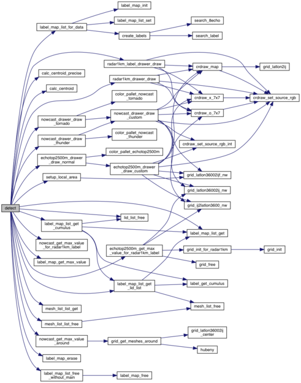
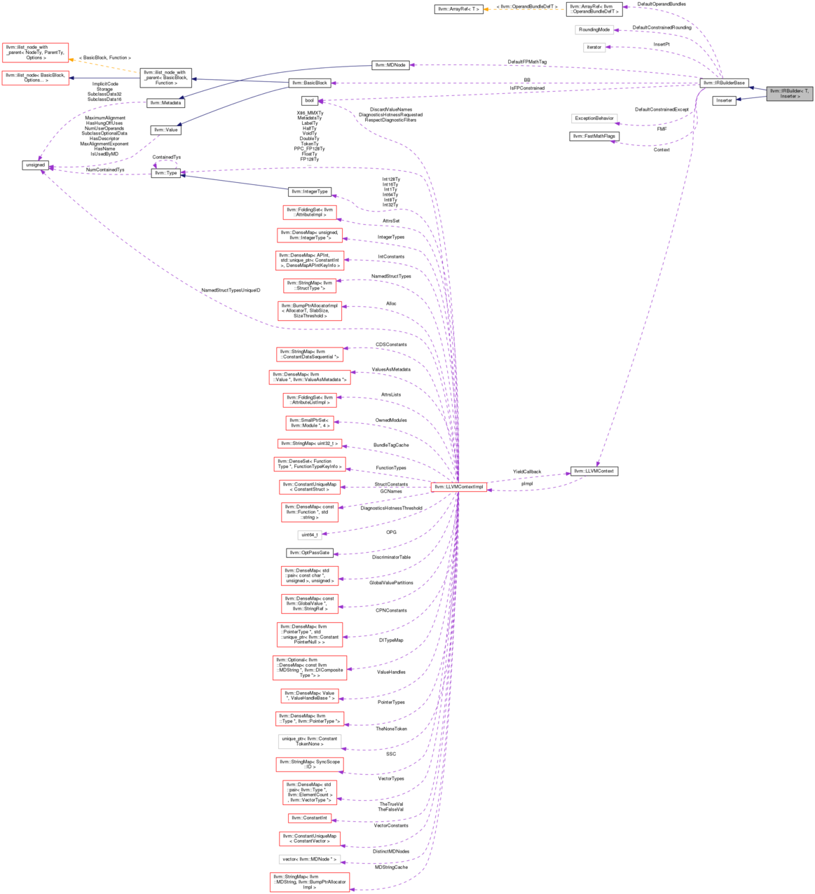
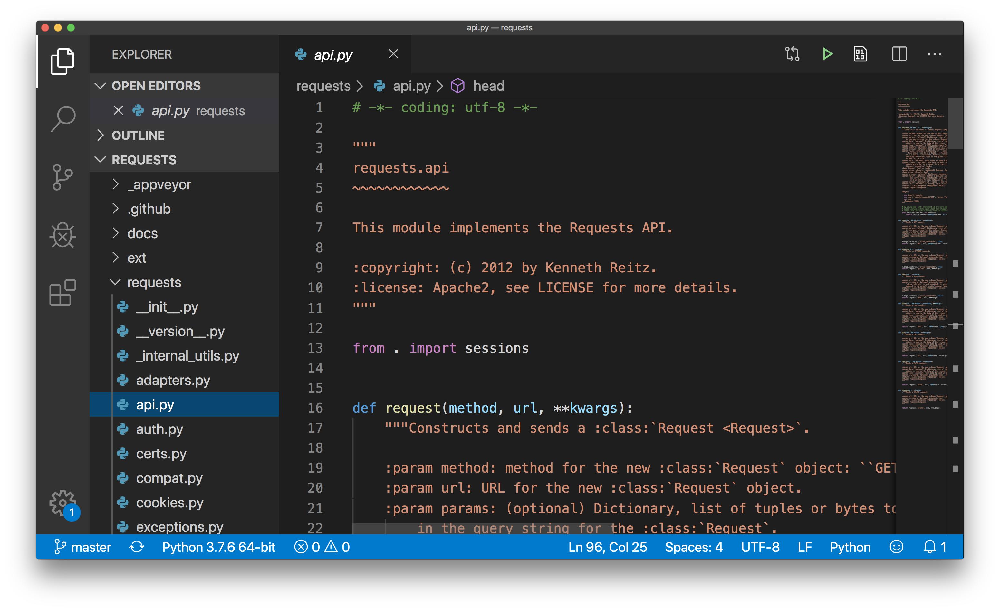
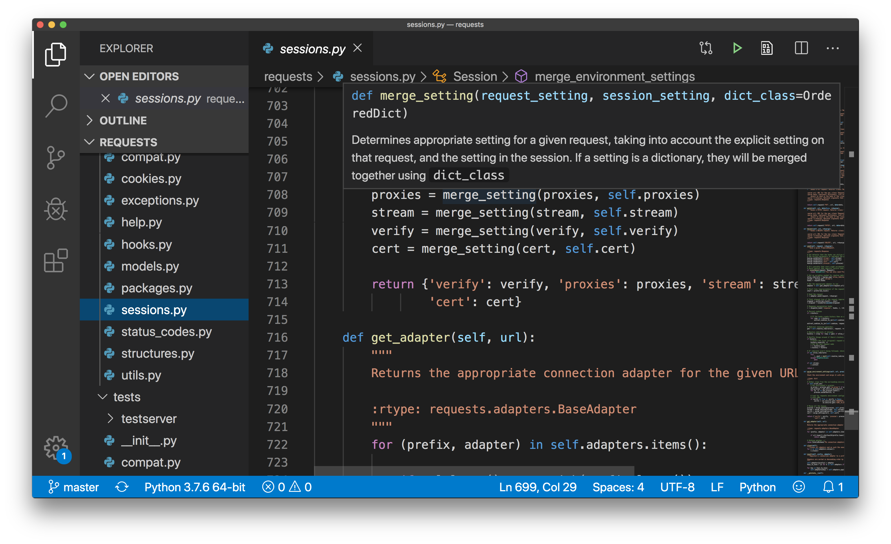

# 継続トレーニング #13：コードリーディング

## 概要

今回はコードリーディング、つまりコードを読む方法の話をし、一緒に読んでみます。

プログラミングスキルを上げるには、ソースコードを書くことも大切ですが、
きちんと書かれたソースコードを読むことも非常に大切です。
1つのソフトウェアのソースコードを読むだけで様々な知識が得られ、
それを自分の書くソースコードに生かせることがあります。
特に今はオープンソースソフトウェアが溢れている時代なので、教材もたくさんあります。
とはいえ、いきなり難しすぎるコードを読もうとしても徒労に終わるだけでしょうし、
質の悪いソフトウェアのソースコードや質の悪いソースコードを読んでも、
（最初から反例と認識しているのでなければ）変な学びに繋がってしまうかもしれません。
ここでは、比較的適切と思われる例を扱います。

ソースコードは、上から1行ずつ読んで、関数があったら辿るという、
コンピュータが読むのと同じやり方で読む類のものではありません
（もちろん、コンピュータが読むやり方で読めば最終的には読めますが）。
ここでは、ソースコードを読むときに頼りになる様々な情報をお話しします。
それによって、自分がコードを書くときにはどんな点に気をつけるのがよいのかも、
考えられるようになるはずです。


### 本日お話すること

* 何故ソースコードを読むのか
* ソースコードの読み方の違い
* 「ソースコードを読む」という作業の全貌
* 「ソースコードを読む」具体的な作業

## 何故ソースコードを読むのか

ソースコードを読む理由で一番多いのは、おそらく次の2つ（この順で）だろう。
どちらも必要に迫られた受動的なケースだ。

* バグの原因を突き止めて直さないといけない
  * 自分のコードであれ他人のコードであれ、不具合が発生したときに、
    不具合を目にした瞬間何が問題なのかわかることはそんなに多くないはず。
* 他人の書いたコードの保守を自分が引き継ぐことになった
  * ドキュメントがないのでソースコードを読んで理解しないといけない、
    あるいはたとえドキュメントがしっかり書かれていても、所詮は他人のコードなので、
    読まないとわからない。
* コードレビューの一環として
  * ソースコードの品質を担保するには、他人に読んでもらうことが重要。
    読まれないソースコードには、かなりの確率でバグがある。

それ以外に、こんな能動的な理由もあるかもしれない。

* 似たようなプログラムを書くので参考にしたい
  * 真似を通じて学んでいくのは赤ちゃんと同じで大切。
    でもコピペはダメよ（マナーではなく法的な意味で）。
* プログラムに新たな機能を加えたい
  * 「バグの原因を突き止めて直さないとまずい」と必要に迫られたわけではなく、
    能動的に、自分の意志でプログラムを拡張したいというケース。
* ソフトウェアをきちんと理解したい
  * たとえば、興味のある機能がどんな方法で実現されているのか理解したい、など。

## ソースコードの読み方の違い

ソースコードの読み方は、色々な要因で変わってくる。

### 目的：特定の機能やバグだけを理解したいのか、全体を理解したいのか

目的が特定の機能やバグだけの調査の場合は、
検索である程度あたりをつけた上でたどっていくだけで理解できることが多い。
他方で全体の理解をしたい場合は、まず全体の俯瞰が必要となる。
当然、簡単なのはたいてい前者である。

### 規模：数千ファイルからなるようなプロジェクトか、1ファイルだけのプロジェクトか

ソフトウェアの規模が小さい場合は、
検索である程度あたりをつけた上でたどっていくだけで理解できることが多い。
他方でソフトウェアの規模が大きい場合は、まず全体の俯瞰が必要となる。

小規模のほうが当然簡単だが、巨大なプロジェクトがものすごく大変かというと、
必ずしもそうではない。

### 言語：Cなのか、Pythonなのか、それとも……

Cのような古い言語のほうが、色々知らなければいけないことは多いし、環境も整えるのが大変。
最近の言語は、効率よく読めるようにしてくれる道具が言語やツールチェインの一部として整備されていることが多い。

また、静的な言語は主に関数名が一意で明確なので簡単にたどっていける。
動的な言語やオーバーライド、リフレクションのような機能がある言語は、
辿る先が変数によって変わったり、単純には辿れなかったりする。

### ここでは

ここでは、ソフトウェア全体を理解するという目的でのコードリーディングを考える。
特定の機能の理解やバグの調査はそのサブセットと考えればよい。

## 「ソースコードを読む」という作業の全貌

「ソースコードを読む」という言葉に対してどのようなイメージを持つかは、
開発経験や知識の違いでかなり変わってくる。

たぶん誰でももつイメージ：

* 文字通りソースコード（プログラム）の流れを追いかける
  * 人によっては画面では読みづらいのでプログラムを紙に印刷するという人もいるかもしれない
* エラーメッセージやログメッセージなどで検索して当該箇所を探す

慣れた人がもつイメージ＆実際にやること：

* ファイルの一覧を俯瞰する
* 設計などについて書かれたドキュメントを読む
* ソースコードとコメントから自動的に生成できるAPIドキュメントを読む
* テストコードやサンプルコードを読む
* クラスや関数の一覧を俯瞰する
* クラスの関係図やコールグラフなどでコードを可視化する
* エディタや統合開発環境の機能を用いて表示を工夫し理解を促進する
* 改変して動かしてみる
* バージョン管理システムで履歴を遡ってみる

それぞれ、以下で見ていく

## 「ソースコードを読む」具体的な作業

### 文字通りソースコードの流れを追いかける

文字通りソースコードの流れを追いかけるのは、
最終的には必要になるのだけど、最後の手段にしたほうがよい。

### エラーメッセージやログメッセージなどでソースツリーを検索して当該箇所を探す

ソースツリーの検索には、昔ながらの方法としては、`grep`コマンドを使う。

最近ではソースコードはGitリポジトリとして得られることが多く、
Gitには`git grep`という便利なコマンドがあるので、それを使うのがよい。
`grep`だと対象ファイルを（主に`*`のようなワイルドカードで）指定しないといけないが、
`git grep`は、バージョン管理対象となっているカレントディレクトリ以下のすべてのファイルを対象に検索してくれるので、わざわざ対象ファイルを指定しなくてよい分、楽に実行できる。

### ファイルの一覧を俯瞰する

ソースツリーには、メインのソースコード以外のものが色々含まれている。
`README`、ドキュメント、ビルドファイル、パッケージングスクリプト、
テストコード、サンプルコード、CI/CDやGit関連の設定ファイルなど。

そのうち、ドキュメントやテストコード、サンプルコードは、
メインのソースコードの理解に直接的につながる可能性がある。
また、実際にいじって動かしてみるときに、
ビルドファイルやパッケージングスクリプトの理解が必要となることもある。
こういった、ソースコードを直接読まずにヒントが得られそうなものがどの程度あるか、
きちんと押さえておくことが大切。

まずは名前や拡張子から、中に含まれる情報やそのファイルフォーマットが推定できればよい。
中身は必要に応じて読めばよい。

### 設計などについて書かれたドキュメントを読む

アーキテクチャなどの設計を説明したドキュメントや、
（特殊な入出力ファイルを扱うのであれば）ファイルフォーマットなどを記したドキュメントがあるのなら、
まずはそれらを読むのが大切。
ドキュメントを読まずにソースツリーを眺めるのとドキュメントを読んでからソースツリーを眺めるのでは、見方がかなり変わる。
いきなりソースコードを読むのは愚の骨頂。

ただし、ソースコードがアップデートされてもドキュメントはそのまま、というケースは少なくない。
ドキュメントと最新のソースコードの間に乖離がある可能性は一応頭の片隅に入れておく。

「設計などについて書かれたドキュメント」の例：

* Python: ["23. Exploring CPython’s Internals" in "Python Developer’s Guide"](https://devguide.python.org/exploring/)
* Git: "10.2 Git Internals - Git Objects" in "Pro Git" ( [en](https://git-scm.com/book/en/v2/Git-Internals-Git-Objects) / [ja](https://git-scm.com/book/ja/v2/Gitの内側-Gitオブジェクト) )

### ソースコードとコメントから自動的に生成できるAPIドキュメントを読む

JavaならJavadoc、Pythonならpydoc、RubyならRDoc、GoならGoDoc、Rustならrustdocなど、
1995年ごろ以降のプログラミング言語にはたいてい、
ソースコードとコメントから自動的にAPIドキュメントを生成できる文法とツールが備わっている。
また、そのようなツールで生成されたドキュメントがオンラインに置かれていたりする。
オンラインになくても自分で生成し、ソースコードの理解に役立てられる。

この「コメント」は、Javaではdocumentation commentと呼ばれ、
ほかの言語でもdoc commentなどと呼ばれることが多い。
Pythonの場合はコメントではなく文字列（文字列リテラル）という位置づけで、docstringという。

古い言語であるCにはそのような文法は存在しないが、
特定の場所に特定のフォーマットでコメントを書くとそれを認識してくれるDoxygenというツールが存在する。
またツールチェインの一部としてツールが公式に提供されている言語であっても、
Pythonでもpydocの代わりにSphinx、
RubyでもRDocの代わりにYARDを用いたドキュメント生成をするソフトウェアも存在する。

* ソースコードと一緒にコメントの文言をアップデートできるため、
  ソースコードとドキュメントの乖離がしにくい
* 公式のドキュメントがなくても、またオフラインでも、
  必要に応じて自分でローカルでドキュメントを生成でき、ソースコードの理解に役立てられる

というポイントが重要なので、ツール自体は道具に過ぎない。

例：
* [pandas.DataFrameのdocstringからSphinxで生成されたAPIドキュメント](https://pandas.pydata.org/pandas-docs/stable/reference/api/pandas.DataFrame.html)

◆参考：
* ["Automatic documentation generation"](https://en.wikipedia.org/wiki/Comment_(computer_programming)#Automatic_documentation_generation)

### テストコードやサンプルコードを読む

テストコードは、
関数の使い方（どのように呼び出され、どのような結果が期待されるか）の理解に役立つ。
サンプルコードも（期待する結果の情報は含まれていないが）同様である。

たとえば、以下は小林がバグ修正時にpandasに加えたテストコードで、
これを読めば関数の理解につながる（ただしこのコードはリフレクションを用いており、
テストフレームワークも動的な機能を用いているため、慣れないと読めないかも）。

[commit e0c63b4cfaa821dfe310f4a8a1f84929ced5f5bd](https://github.com/pandas-dev/pandas/commit/e0c63b4cfaa821dfe310f4a8a1f84929ced5f5bd)

```.py
@pytest.mark.parametrize(
    "op, expected",
    [
        (
            "shift",
            {
                "time": [
                    None,
                    None,
                    Timestamp("2019-01-01 12:00:00"),
                    Timestamp("2019-01-01 12:30:00"),
                    None,
                    None,
                ]
            },
        ),
        (
            "bfill",
            {
                "time": [
                    Timestamp("2019-01-01 12:00:00"),
                    Timestamp("2019-01-01 12:30:00"),
                    Timestamp("2019-01-01 14:00:00"),
                    Timestamp("2019-01-01 14:30:00"),
                    Timestamp("2019-01-01 14:00:00"),
                    Timestamp("2019-01-01 14:30:00"),
                ]
            },
        ),
        (
            "ffill",
            {
                "time": [
                    Timestamp("2019-01-01 12:00:00"),
                    Timestamp("2019-01-01 12:30:00"),
                    Timestamp("2019-01-01 12:00:00"),
                    Timestamp("2019-01-01 12:30:00"),
                    Timestamp("2019-01-01 14:00:00"),
                    Timestamp("2019-01-01 14:30:00"),
                ]
            },
        ),
    ],
)
def test_shift_bfill_ffill_tz(tz_naive_fixture, op, expected):
    # GH19995, GH27992: Check that timezone does not drop in shift, bfill, and ffill
    tz = tz_naive_fixture
    data = {
        "id": ["A", "B", "A", "B", "A", "B"],
        "time": [
            Timestamp("2019-01-01 12:00:00"),
            Timestamp("2019-01-01 12:30:00"),
            None,
            None,
            Timestamp("2019-01-01 14:00:00"),
            Timestamp("2019-01-01 14:30:00"),
        ],
    }
    df = DataFrame(data).assign(time=lambda x: x.time.dt.tz_localize(tz))

    grouped = df.groupby("id")
    result = getattr(grouped, op)()
    expected = DataFrame(expected).assign(time=lambda x: x.time.dt.tz_localize(tz))
    tm.assert_frame_equal(result, expected)
```

簡単な説明：
* タイムゾーンの入ったデータに`shift`、`bfill`、`ffill`といった操作を実行すると、
  タイムゾーン情報が落ちたデータが出力される、というバグの修正を確認するテスト。
* `@pytest.mark.parametrize`で与えた「操作 + 期待する結果」ペアのデータ3パターン、
  および`tz_naive_fixture`で与えた様々なタイムゾーン（Nパターン）について、
  関数内のテストを実行し、`result`が`expected`と同一であることを確認している。
* `getattr(grouped, op)()`は、opに渡された文字列に相当するメソッドを実行するもので、
  たとえば`op`が`"shift"`なら`grouped.shift()`という呼び出しとなる。

### クラスや関数の一覧を俯瞰する

ファイルの一覧を俯瞰するのと同じように、
実際にクラスや関数の中身のコードを読む前に、
ファイル内にどのようなクラスや関数があるか俯瞰するのも大切。
名前をもとに、だいたいどのようなことを行うクラスや関数なのか、想像できる。

名前が非常に大切だということがわかる。

### クラスの関係図やコールグラフなどでコードを可視化する

クラスの親子関係を可視化したり、
関数が他の関数からどのように呼び出され、どのように呼び出しているかを可視化したりするのも、
全体を把握するのに大切である。
これだけですべてが把握できるわけではないが、参考にはなる。

呼び出し関係を可視化したものをコールグラフという。

小林の作ったとあるデータのコールグラフ：


LLVMのとあるクラス関係図：


### エディタや統合開発環境の機能を用いて表示を工夫し理解を促進する

エディタや統合開発環境には、コードリーディングを促進してくれる様々な機能がある。

* キーワード、関数名や変数名、コメント、数値や文字列のリテラル、などによる色分け
* ファイルの全貌をサムネイルのように表示して眺められるアウトライン機能
* 現在カーソルがある位置にある変数の型や関数の定義などを教えてくれる機能
  （さらにいえば定義部分へとジャンプしてくれる機能）

特にアウトライン機能は有用で、
たとえば下の1つ目の図では「ほとんどdocstringでコードがない」などと一発でわかる。





### 改変して動かしてみる

ソースコードを読む上では、これまで示した情報を眺めて理解するだけでなく、
「動かして理解する」のも重要。
気になる場所に`print`文を仕込むなどして理解を深めることができるのが、
読書などとは異なる、コードリーディングのメリットでもある。
特にバグ修正のための調査の場合は、どちらにしろ修正のために動かすことが必要となるので、
動かすのは必須となる。

もっとも、自分の理解のためにいじったものを勝手にシステムに入れるわけにも行かず、
システムにインストールせずに動かす、というのが難しい場合もある。
そのような場合はDockerコンテナのような仮想化環境を使い、
システムの環境と分けるのがよい。
とはいえ、依存関係やビルド、パッケージ化などの知識が必要になる場合もあるので、
必ずしも簡単ではない。

また、動かすと何か通信をして他のシステムに影響を与えてしまうような場合もあるので、
当然ながら自分が動かそうとしているのがどのようなプログラムなのかの理解は必要となる。
無闇矢鱈と動かせばよいというものではない。

### バージョン管理システムで履歴を遡ってみる

Gitというバージョン管理システムが普及したことで、
誰でもソフトウェアの履歴を自由に追いかけられるようになった。
バージョン管理システムはこんなことに使える。

* ソフトウェアの規模がもっと小さかった昔の姿に戻して眺める
* 特定のコードの履歴をさかのぼり、何故今の姿になったのか、
  ログやログに書かれたIssue番号などを用いて理解する。
