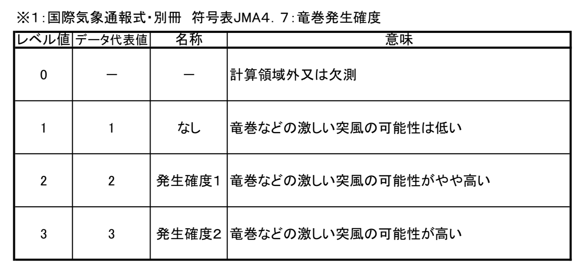
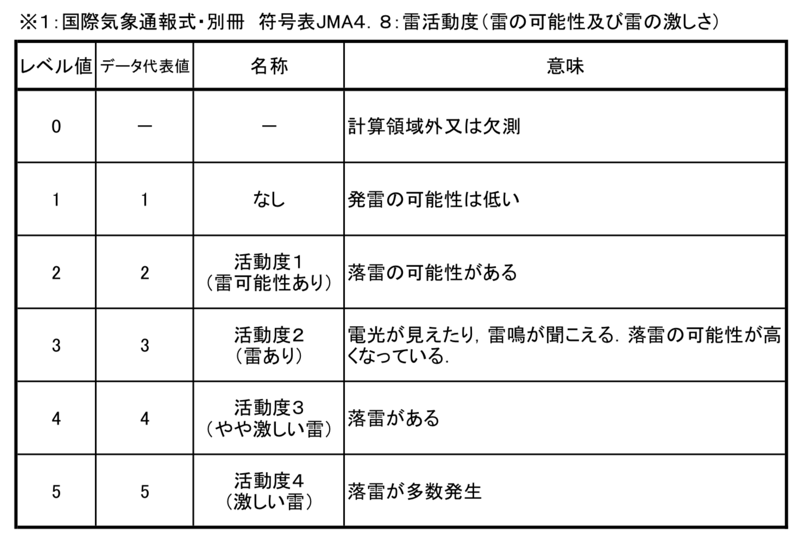

# テック系ZUKKOKE議論第1回：データ関連のZUKKOKE

こんなことがありました。
どうしたら防げる、あるいは事前に気付けるでしょうか？？

## 風向や海流の向きを逆に表示していた

気象データ（何のだかよくわかっていない）の風向などを逆に表示してしまった。
たとえば、「北東」であれば「南西」として表示した。要は、「北東」を向く矢印を描画した。

TODO:
聞いた話を何となく覚えているだけなので、もう少ししっかり裏をとり、具体的に書く。

## コンテンツに「999℃」と出してしまった

前に説明したように、定期的に観測して世の中に提供する必要がある気象観測データでは、
欠測した気象要素があっても、欠測値としてデータに含めないといけない。
普段は観測した数値が入るため、数値として扱えないといけないので、
欠測値としては999などの極端な数値を使う。

この999をそのまま気温として表示してしまった。

## 竜巻発生確度ナウキャスト、雷ナウキャストのレベル値と意味を取り違えた

竜巻が発生する危険性を示す竜巻発生確度ナウキャストや、
雷が発生する危険性を示す雷ナウキャストのデータのレベル値と意味は次のように定義されている。

http://www.data.jma.go.jp/add/suishin/jyouhou/pdf/312.pdf

これを見るとわかるように、
たとえばレベル値が2、3が表すのは、「発生確度1、2」や「活動度1、2」であり、
1ずつずれている。

ナウキャストのデータは、竜巻発生確度ナウキャストなら10km、
雷ナウキャストなら1kmの格子ごとにこのレベル値が振られた格子データとなっている。
誤って、読んだレベル値をそのまま発生確度や活動度として出力するプログラムを書いてしまった。
幸い自分で気づけたが、同じことを別の人もした。

## GRIB2の座標系が南西→北東か北東→南西か

GRIB2のとある格子データは、ファイルの中に北東→南西の順に並んでいるが、
南西→北東の順に並んでいる時期があったらしい。

（どう防ぐかを考えるには、GRIBの内部構造を知らないと厳しい面もあるけど。。。）
